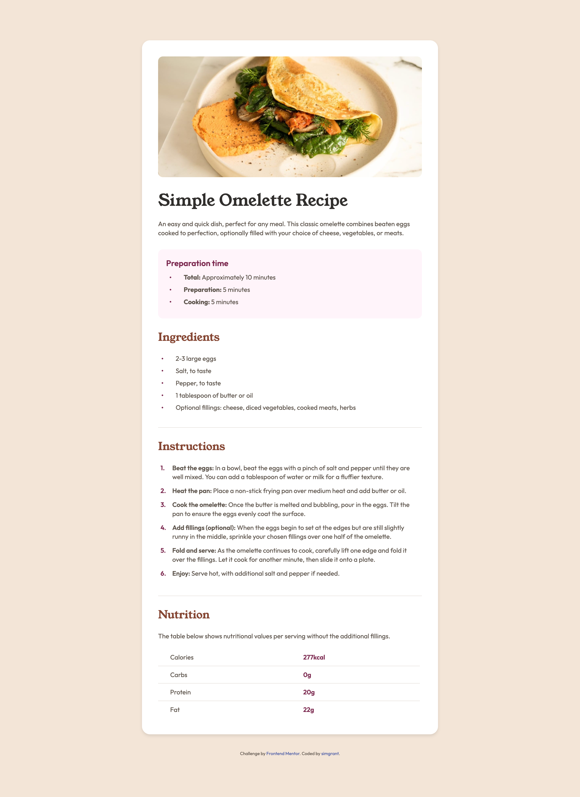

# Frontend Mentor - Recipe page solution

This is a solution to the [Recipe page challenge on Frontend Mentor](https://www.frontendmentor.io/challenges/recipe-page-KiTsR8QQKm). Frontend Mentor challenges help you improve your coding skills by building realistic projects. 

## Table of contents

- [Overview](#overview)
  - [The challenge](#the-challenge)
  - [Screenshot](#screenshot)
  - [Links](#links)
- [My process](#my-process)
  - [Built with](#built-with)
  - [What I learned](#what-i-learned)
  - [Continued development](#continued-development)
  - [Useful resources](#useful-resources)

## Overview

### Screenshot



### Links

- Solution URL: [solution URL](https://simgrant.github.io/recipe_page)

## My process

### Built with

- Semantic HTML5 markup
- CSS custom properties
- Mobile-first workflow

### What I learned

While working on this project, I reinforced several key concepts:

1. **CSS Custom Properties**:
   - Leveraged CSS variables (e.g., `--white`, `--stone-100`) to maintain consistent styling and make the code more maintainable.

```css
:root {
  --white: hsl(0, 0%, 100%);
  --stone-100: hsl(30, 54%, 90%);
  --font-body: 'Outfit', sans-serif;
}
```

2. **Font Management**:
   - Implemented variable fonts (`Outfit-VariableFont_wght.ttf`) for better performance and flexibility, reducing the need for multiple static font files.

```css
body {
  font-family: var(--font-body);
  line-height: 1.4;
  color: var(--stone-100);
}
```

3. **Typography**:
   - Applied consistent typography using custom font families (`Outfit` and `Young Serif`) and appropriate line heights for readability.

```css
@media (min-width: 600px) {
  body {
    margin: 40px;
  }
}
```

### Continued development

In future projects, I plan to focus on the following CSS concepts:

1. **CSS Architecture**:
   - Learn and apply methodologies like BEM (Block Element Modifier) or ITCSS (Inverted Triangle CSS) for better scalability and maintainability of stylesheets.

2. **CSS Variables and Theming**:
   - Expand the use of CSS custom properties to create dynamic themes and improve reusability.

3. **Responsive Typography**:
   - Use techniques like `clamp()` and fluid typography to ensure text scales well across different screen sizes.


### Useful resources

- [MDN Web Docs - CSS Custom Properties](https://developer.mozilla.org/en-US/docs/Web/CSS/--*) - A comprehensive guide to understanding and using CSS custom properties effectively.
- [Google Fonts Knowledge - Variable Fonts](https://fonts.google.com/knowledge/introducing_type/variable_fonts) - An excellent introduction to variable fonts and their benefits.

